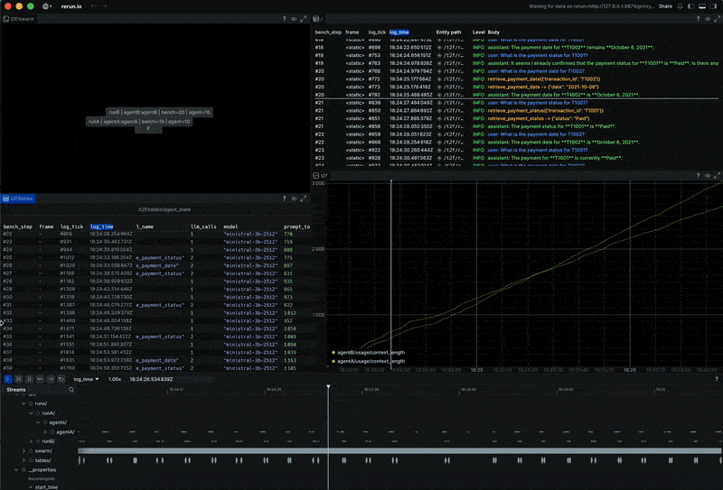

<div align="center">

<h1>terminal2F <i>(WIP)</i></h1>
<b>A way to observe agents and agent systems</b>
<br><br>
<i>Monitor • Trace • Visualize LLM calls.</i>

</div>

<br>

<p align="center">

</p>

---

## What is this

Currently this is a terminal LLM agent runner built on Mistral’s chat API, with tool-calling, multiple “runner” strategies, and a Rerun-based observability/control tower for visualizing agent behavior + usage.

terminal2F is a small research harness for running agents and watching them think. You can run the same task through different runner types and compare how they behave.

The idea comes from a simple split: the agent is just the model caller (the brain), and the runner is the memory plus the control policy (the automaton). Different memory architectures give you different computational power. A basic loop with chat history, a finite state machine, a pushdown automaton with a stack, or something with read/write memory you can revisit.

Everything streams to [Rerun](https://rerun.io). Tool calls, model responses, token usage, and a little visualization of who's talking to who. You get a timeline you can scrub through, zoom in on, and actually see what happened when things break.

Built with Mistral models. No frameworks, just Python.

---

> [!WARNING]
> This project exposes a bash tool that executes arbitrary shell commands on the host machine. If an LLM calls this tool it can read or modify files, run destructive commands, and potentially access secrets from the environment. Do not enable this tool on any machine that contains sensitive data. Only use it in a disposable development environment or after you add strict allowlisting or sandboxing. I have disabled it to a degree..

---

## Notes

### How does terminal2F currently work

- **agent.py** only does the model call. It takes messages and optional tools, hits Mistral, returns the raw response.
- **runner** owns the whole loop. It appends user messages, calls agent.step, handles tool calls, appends tool results, and keeps looping until we get a final assistant message.
- **control_tower.py** is just observability. It logs turns, tool calls, tool results, assistant text, and usage to Rerun, plus the little swarm viz stuff.
- **Tools are capability on the agent, permission on the runner.** The agent can be initialized with tools=tools (everything installed), but the runner decides what the model can actually see and execute for that run.

### Agent Profiles

Agent profiles are saved configurations for an agent. A profile bundles together who the agent is, how it should behave, and what it's allowed to do.

A profile defines:

- **Model config** — which model, temperature, max tokens
- **Tool policy** — which tools the agent can call (none, some, or all)
- **Budgets** — context budget, max tool turns before stopping
- **System prompt** — the default vibe/instructions for the agent

When you spawn an agent, you just pass a profile name and you get that whole setup instantly. No extra wiring every time.

```python
# Built-in profiles:
"default"       # payments tools only, conservative limits
"chat_safe"     # no tools at all, just chat
"dev_all_tools" # all installed tools enabled
```

Tool policy semantics:

- `allowed=None` or `allowed={"*"}` → allow ALL installed tools
- `allowed=set()` → allow NO tools
- `allowed={"tool_a", "tool_b"}` → allow only listed tools

### Experiments

setup, a single Rerun recording is one experiment. An experiment can contain multiple agents running side by side, and each agent instance produces its own logs and metrics while sharing the same experiment context.

Within an experiment, you create episodes by clearing the conversational state. A clear does not rewind time. It resets the agent's message history so context length drops naturally, and it logs a clear event so the episode boundary is explicit and easy to spot later. Because the turn counter is monotonic for the entire experiment, nothing gets overwritten in Rerun and you can reliably compare behavior across episodes, across agents, and across different runner implementations inside the same experiment.

only thing missing is clear terms... yeah

---

## TO-DOS

### QueueHandler/QueueListener + Rerun can get weird on quit

When putting logging behind a queue, the actual send to Rerun happens on the listener thread, and Rerun's flush guarantees are basically "for the calling thread" (other threads can still have stuff in flight). So it can look like the queue handler kinda fucks with the Rerun logs at shutdown (last messages missing / not fully flushed).

**Current approach:** Keeping it simple (no queue) for now.

**Future consideration:** If/when the queue is re-added, it likely needs an explicit shutdown order:

1. Stop listener
2. Flush/disconnect

### Token Prediction

Add token prediction so you I see how much context a request will take before sending it. Pretty useful for staying under limits and knowing when to trim history. Will use the Mistral's tokenizer from mistral-common since we're on Mistral models. Viz this too with two scalars, prediction and actual..

### Step inside Turns

Later add per-turn "step" indexing (1.1, 1.2, 1.3) for internal tool calls also when talking to sub-agents. Keep turn_idx as the user interaction counter. Add step_idx inside this turn and pass it into control_tower hooks. That will let Rerun show ordering within a single user turn.

### Tokens

prompt_tokens is the size of what is sent into the model for this call.
might be interested to look at response.usage.total_tokens or
response.usage.completion_token
the model also needs room for the output so I can't just use prompt tokens like now..

### Jinja Templates

introduce jinja templates in the future, that's going to be poerfull yeah

### Change semantics around logging

mylogger folder name etc..

### Blueprints

Blueprints do not summarise anything. They only choose what the viewer shows from logs you already wrote. To “summarise / look back”, that is a CLI command or a report generator. Blueprint just helps focus on a slice of that data.

This goes into the idea of auto making an pdf report..

Always concerned with correctness and isolation
What the viewer shows
