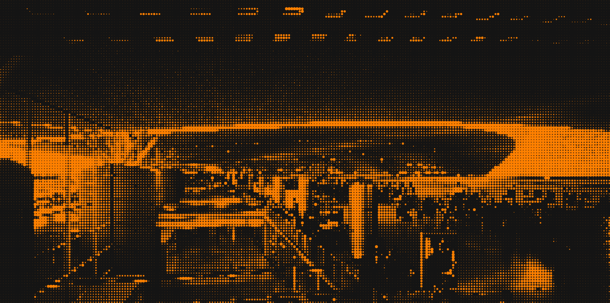
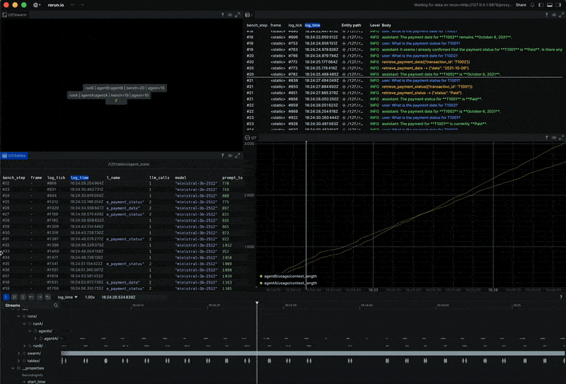

<div align="center">

<h1>terminal2F <i>(WIP)</i></h1>
<b>A research platform for agents and agent systems</b>
<br><br>
<i>Monitor • Evaluate • Train</i>

</div>

<br>

<p align="center">

</p>

---

## How To Run

```bash
# Interactive chat (default loop runner)
t2f chat

# Chat with a specific automaton/runner
t2f chat --automaton fsm    # or pda, tm, lba

# Start Rerun observability server
t2f serve record             # run experiment, write .rrd files
t2f serve load <run_id>      # load existing run into viewer
t2f serve live               # stream to viewer in real-time (stub)
```

Requires `MISTRAL_API_KEY` in your `.env`. The `t2f` command is available after installing the package. Switch automaton during chat with `/automaton <name>`. Exit with `/q` or `quit`.

---

## What is this

---

## Primitives

#### Systems

A Clock is the execution environment for N agents on a shared clock. One root agent owns the clock, sub-agents are spawned into it. All agents in a clock share an object store (the shared artifact space) and tick on the same clock. The clock decides when agents run, what they can see, and when they're done. Inspired by [State Machines for Multi-Agent](https://eriksfunhouse.com/writings/state_machines_for_multi_agent_part_1/) and [P2Engine](https://github.com/gustofied/P2Engine).

#### Agent

The Agent is a single chat completion call. It holds config (model, temperature, system prompt, tools) and exposes one method: act. No memory, no loop, no state. That all lives in the automaton.

#### Memory

There are three layers of memory: raw messages (for the typical agent loop), a typed interaction stack (for the state machine runners), and an object store (long-term artifacts, TM-level). What gets used and how is up to the automaton. The memory architecture is what determines the agent's computational power: bounded context gives you an FSM, a stack gives you a PDA, read/write memory gives you a TM.

#### Tools

Currently tools are implemented in the standard way per [Mistral function calling](https://docs.mistral.ai/capabilities/function_calling).

---
